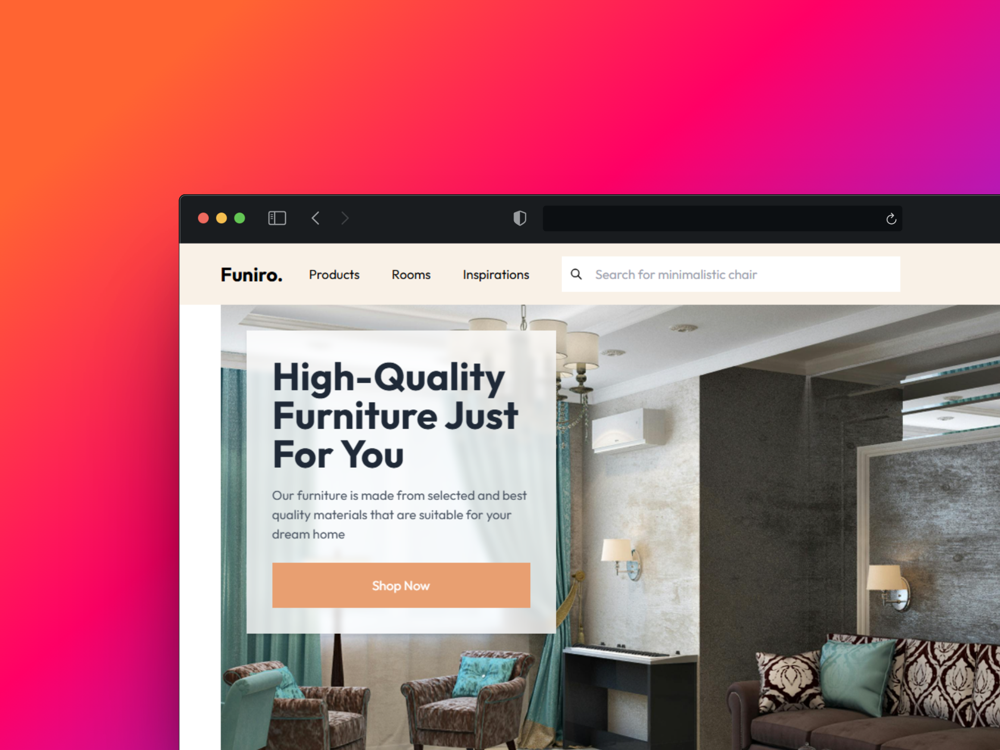

# Funiture Store

Sitio web desarrollado como práctica utilizando React y Tailwind CSS. Este proyecto tiene fines exclusivamente educativos y no está destinado a actividades comerciales.

## Tecnologías utilizadas
- React
- Tailwind CSS
- React Router

## Créditos
El diseño original de esta página pertenece a:

- Autor: [@yahyaamirudin](https://www.figma.com/@yahyaamirudin)  
- Diseño original: [Furniture Shop](https://www.figma.com/community/file/897678945740792228/furniture-shop-freebie)